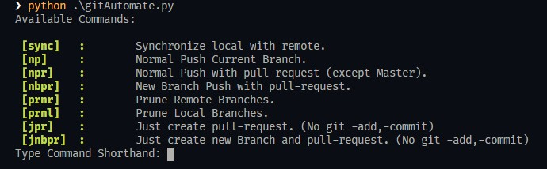

# GitHub Automation Script

This is a Python script to automate The boring stuff 🚀.

## Installation

You may need the package [click](https://pypi.org/project/click/) to install click.

```bash
pip install click
```

## Alter Configurations

> In gitAutomate.py change the path of the chrome browser according to your setup

```python
webbrowser.register('chrome', None, webbrowser.BackgroundBrowser(
    "C://Program Files (x86)//Google//Chrome//Application//chrome.exe"))
```

> In main.py you can setup default variable at top starting with "\_"

```python
_remote = "your remote name"
```

## Usage

### <span style="color:#CC3333">**Note: Make Sure you have changes to commit; On 🚫"Clean working dir"🚫 commands will not work**<span>

> Add git.py , gitAutomate.py and main.py at your project root and Update your gitignore

```
__pycache__
git.py
gitAutomate.py
main.py
```

> Run the main.py from your project root ( **python -u .\main.py** )

> You can run the script with choice & argument (remote)

```
python .\main.py --choice=npr origin
```



## <span style="color:#FFCC00">"Normal Push" includes 'git add' and 'git commit'<span></span>

## Upcoming

Commands without changes (Clean working Dir) :

- Just create new Branch and pull-request.
- Just create pull-request.
- ✅ Prune local branches with the selected remote.
